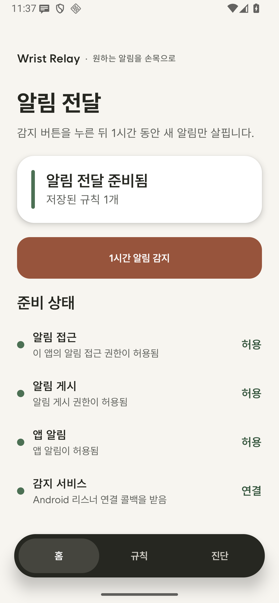
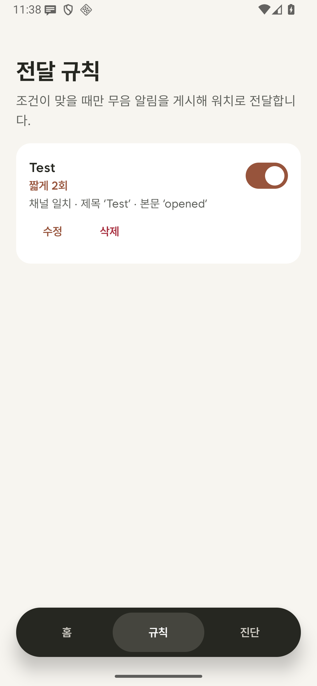
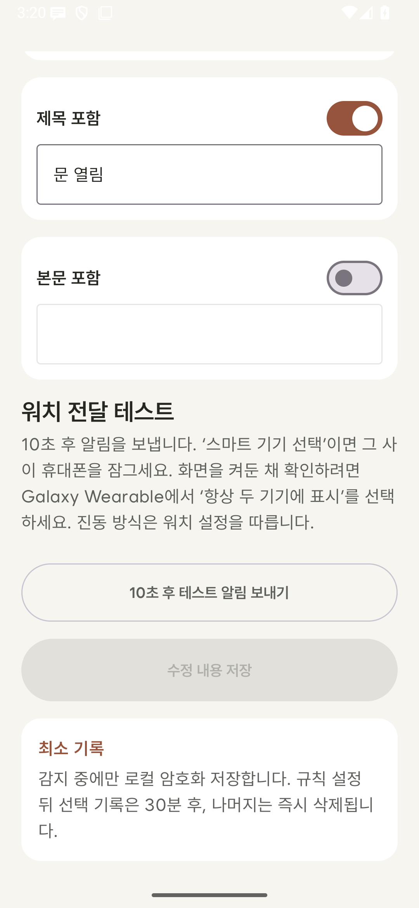
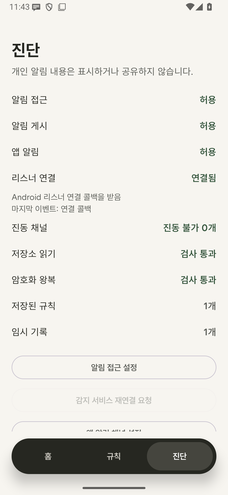

# Wrist Relay

Android notification relay for selected alerts on Galaxy Watch — local-first, phone-only.

원하는 휴대폰 알림만 손목으로 전달하는 Android 앱입니다. 휴대폰에만 설치하며, 워치 앱·계정·서버는 없습니다. 현재 검증 대상은 Galaxy S25 Edge와 Galaxy Watch Ultra (2025)이지만, 특정 모델 코드에 의존하지 않고 Android 알림 권한과 리스너 연결 상태로 동작을 판단합니다.

## 사용 방법

1. 앱의 알림 접근·알림 게시 권한을 허용하고 Galaxy Wearable에서 Wrist Relay 알림을 워치에 허용합니다.
2. `1시간 알림 감지`를 누른 **뒤** 원하는 원본 알림을 발생시킵니다. 이전 알림 기록을 훑지 않습니다.
3. 새로 수집된 알림에서 채널·제목·본문 조건을 선택하고 `10초 후 테스트 알림 보내기`를 누릅니다. Galaxy Wearable이 `스마트 기기 선택`이면 10초 안에 휴대폰을 잠그세요. 화면을 켜둔 채 테스트하려면 `항상 두 기기에 표시`로 설정해야 합니다.
4. 워치에서 실제로 알림을 받은 뒤 확인하고 규칙을 저장합니다. `규칙` 화면에서 나중에 조건·이름을 수정하거나 활성화·삭제할 수 있습니다.
5. 휴대폰만 조용히 하려면 Galaxy Wearable의 `휴대전화 알림 무음` 설정을 켭니다. 워치의 진동 방식은 Galaxy Wearable → 워치 설정 → 소리 및 진동에서 정합니다. 휴대폰 앱이 워치 진동 패턴을 알림마다 지정하거나 실제 수신을 자동 검증할 수는 없습니다.

기존 0.1.2 이하에서 저장한 진동 프리셋 값은 규칙 호환성을 위해 보존하지만, 0.1.3부터는 사용하지 않습니다. 모든 규칙은 같은 워치 전달용 알림 채널을 사용합니다.

감지는 최대 1시간이며, 상시 알림·그룹 요약·앱 자체 알림·동일 알림 키의 반복 갱신은 기록하지 않습니다. 규칙 설정 시 선택하지 않은 기록은 즉시, 선택 기록은 30분 후 삭제합니다. 캡처는 한 번에 최대 250건으로 제한합니다.

## 상태와 진단

`알림 접근 허용`은 **해당 리스너 컴포넌트의 권한**이며, `리스너 연결`은 Android가 실제 연결 콜백을 보냈는지의 별도 상태입니다. 권한만 허용되고 연결되지 않았다면 진단에 그대로 표시됩니다. `감지 서비스 재연결 요청`은 요청일 뿐 성공 표시가 아니며, 연결 여부는 후속 콜백으로 판단합니다. 저장소 읽기와 암호화 왕복 검사는 실제 실행한 결과만 보여줍니다. 진단 공유에는 알림 제목·본문·앱 패키지명을 넣지 않습니다.

## 설치와 업데이트

최신 설치 파일은 [GitHub 릴리스](https://github.com/SMSM237/wrist-relay/releases)에서 확인하세요. 이 저장소의 `0.1.3-debug`는 휴대폰 앱만 설치하는 시험판입니다.

`wrist-relay-0.1.3-debug.apk`는 개발용 서명 APK입니다. 이전 디버그판과 같은 인증서로 서명하고 버전 코드를 올렸습니다. 정상적인 업데이트 설치 시 앱 데이터와 규칙을 유지하도록 설계했지만, 실제 기기 업데이트는 아직 검증하지 못했습니다. Android가 외부 설치를 경고할 수 있습니다. 릴리스의 SHA-256 값을 확인하세요. Google Play 배포용 최종 서명판은 아닙니다.

실제 휴대폰·워치의 리스너 연결, 삼성월렛 알림 매칭, 워치 진동은 이 원격 개발 환경에서 확인하지 못했습니다. 에뮬레이터 결과를 실제 기기 성공으로 해석하지 마세요.

## 빌드

- Android SDK API 36 / Build Tools 36.0.0
- JDK 17 / Gradle 9.5.0
- `./gradlew.bat testDebugUnitTest lintDebug assembleDebug assembleDebugAndroidTest` (Windows)

Android 8.0(API 26) 이상을 대상으로 합니다. 정적 Wanted Sans TTF는 [SIL Open Font License 1.1](licenses/WantedSans-OFL.txt)로 포함했습니다.

## 개인정보·보안

인터넷 권한이 없고, 알림 내용·식별자는 기기 내 Android Keystore 기반 AES-GCM으로 암호화합니다. 백업을 끄고 릴리스 빌드의 화면 캡처를 막습니다. 자세한 내용은 [개인정보 처리](PRIVACY.md)와 [보안 설계](SECURITY.md)를 참고하세요. 보안 문제를 공개 이슈에 알림 원문·DB·키와 함께 올리지 마세요.
